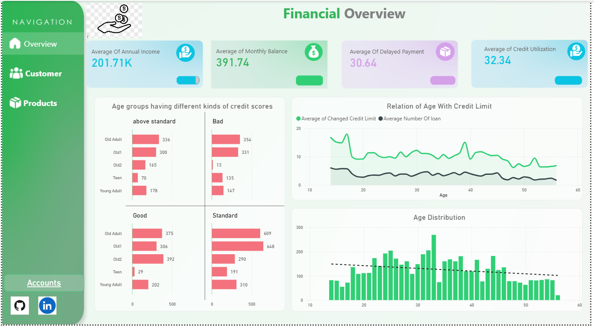
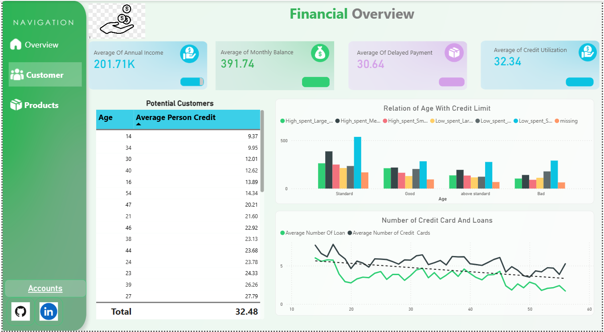
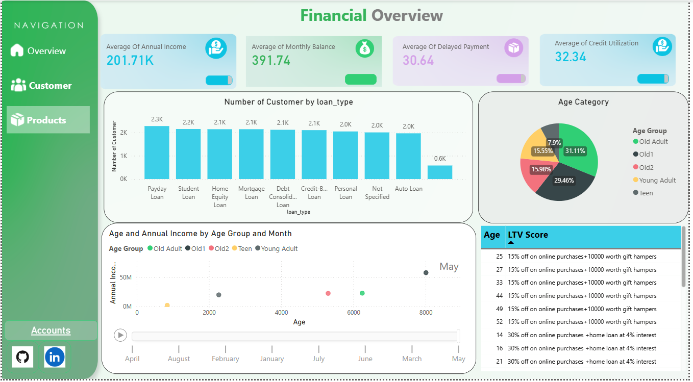

#  Automated Financial Data Pipeline & Power BI Dashboard

## 📌 Overview

This project delivers an end-to-end automated solution for processing daily financial data and generating insightful Power BI dashboards. It was developed to address inefficiencies in a manual workflow involving multiple files, tight deadlines, and high error rates.

The system automates data collection, transformation, and visualization—reducing processing time, minimizing errors, and significantly lowering operational costs.

---

##  Problem Statement

The client was facing several challenges in their daily workflow:

*  Time-consuming manual data handling (25+ files daily)
*  Increased operational cost (~$12,000/month due to extra hires)
*  High error rates during data processing
*  Reduced efficiency affecting other projects

---

##  Solution Overview

### 🔄 Automated Data Pipeline

We built a fully automated pipeline that:

1. **Fetches Data Automatically**

   * Downloads email attachments daily (via automation scripts)

2. **Combines Files**

   * Merges 25+ files into a unified dataset

3. **Data Cleaning & Transformation**

   * Handles missing values, formatting issues, and inconsistencies

4. **Data Storage**

   * Stores cleaned data for dashboard consumption

5. **Power BI Integration**

   * Automatically updates dashboards with latest data

---

## 🧠 Key Features

* ✅ Fully automated workflow
* ⚡ Reduced processing time (3–4 hours → minutes)
* 📉 Significant cost reduction
* 🎯 High data accuracy
* 🔄 Scalable architecture

---

##  Power BI Dashboard

### 🔍 Key Insights Delivered:

* Average Annual Income
* Average Monthly Balance
* Average Payment Delays
* Credit Utilization Trends
* Age vs Credit Limit Analysis
* Payment Behaviour by Credit Mix
* Age Group Segmentation
* Loan & Credit Card Trends
* Loan Distribution Analysis

---

## 👥 Age Group Classification

| Age Range | Category    |
| --------- | ----------- |
| 14–19     | Teen        |
| 19–25     | Young Adult |
| 25–35     | Old Adult   |
| 35–45     | Old1        |
| 45+       | Old2        |

---

## 💡 Advanced Analytics

### 📈 LTV (Lifetime Value) Calculation

```
LTV = 
(0.3 × Avg Annual Income) 
- (0.15 × Avg Delay Days) 
+ (0.4 × Avg Credit Score) 
+ (0.075 × Avg Investment) 
+ (0.075 × Avg Monthly Balance)
```

### 🎁 Promotion Strategy

| LTV Range | Offer                    |
| --------- | ------------------------ |
| > 80,000  | 30% off + Home Loan @ 4% |
| 60k–80k   | 15% off + Gift Hampers   |
| 50k–60k   | Loan @ 5%                |

---

## 📷 Dashboard Screenshots






---

## 🎥 Project Demo (YouTube)

[](https://youtube.com/watch?v=ufeEwpHsgCc)

---

## 🤖 Automation Workflow Video


* Automated Email Extraction
* File Merging & Cleaning Scripts
* Scheduled Execution
* Dashboard Auto Refresh

👉 Watch here: https://youtu.be/ufeEwpHsgCc?si=GwX6nTGy-n_rgebL

---

## 🛠️ Tech Stack

* **Python** (Data Processing & Automation)
* **Pandas** (Data Cleaning)
* **Power BI** (Visualization)
* **Excel** (Data Sources)
* **Automation Scripts** (Scheduling & Execution)

---

## 📈 Business Impact

* ⏳ Reduced processing time by **80%+**
* 📊 Improved decision-making with real-time insights
* 🚀 Increased overall team productivity

---

## 📬 Client Feedback

> “The automation has saved significant time and improved our efficiency. The dashboard insights have been extremely valuable for decision-making.”

---

## 📌 Future Improvements

* Real-time data streaming
* Cloud deployment (AWS / Azure)
* Advanced ML-based predictions
* Interactive web dashboards

---

## 👨‍💻 Author

**Kamran Khan Orakzai**
Data Analyst | Data Science  | Mlops

---

## ⭐ Support

If you like this project, give it a ⭐ on GitHub!
